# Sport Mate

**Relazione progetto LAM**

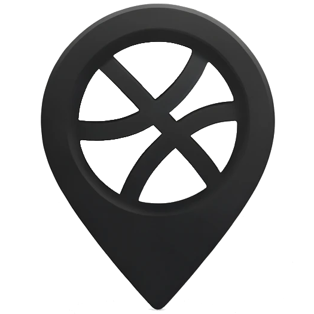

**Giovanni Spadaccini**

giovanni.spadaccini3@studio.unibo.it

---

# Introduzione

Sport Mate è un'applicazione progettata per organizzare e partecipare ad eventi sportivi nella propria zona. 

L'obiettivo principale è quello di facilitare la connessione tra appassionati di sport, permettendo loro di creare, trovare e partecipare a varie attività sportive.

---

## Scelta delle tecnologie

**Dart**

- Semplice e produttivo
- Sintassi chiara e coerente
- Null safety

 **Flutter**

- Supporto eccellente per lo sviluppo multi-piattaforma, componeti definiti in maniera dichiarativa
- principali librerie utilizzate: provider, flutter_secure_storage, flutter_map, flutter_local_notifications

 **Backend**

- Scritto in Python con FastAPI
- Database PostgreSQL

---

## Features dell'applicazione

- **Login**: Autenticazione utenti
- **Signup**: Creazione profilo utente
- **Search**: Motore di ricerca per eventi o partner sportivi con filtri
  - **Mappa**: Visualizzazione eventi sulla mappa
  - **Lista**: Visualizzazione dettagliata degli eventi

- **Creazione Attività**: Creazione nuovi eventi sportivi
- **Storico**: Raccolta eventi passati con possibilità di aggiungere feedback
- **Ricordo**: Lasciare messaggi e punteggi degli eventi
- **Visualizzazione di un'Attività e Partecipazione**: Dettagli evento e iscrizione

---

## Struttura del codice sorgente

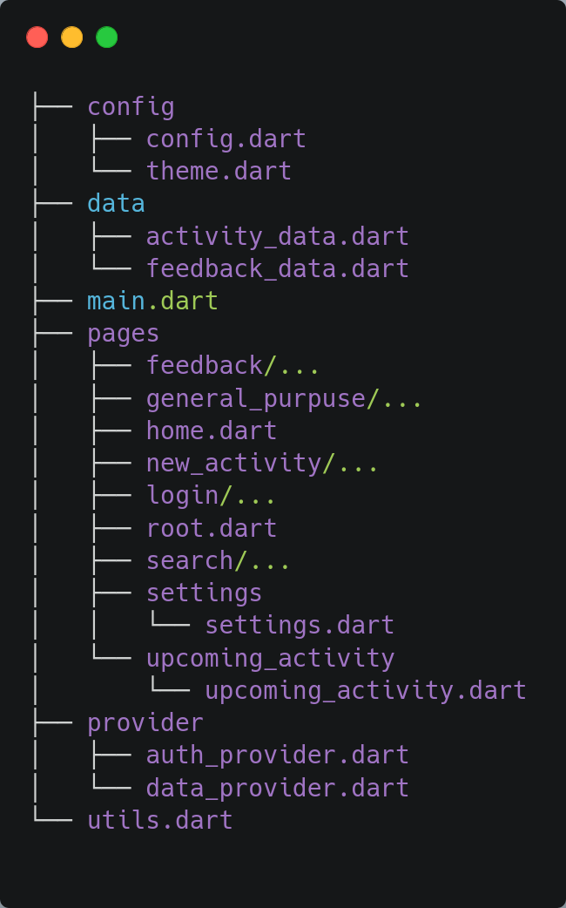

- **config**: Configurazioni globali
- **data**: Strutture dati delle attività e dei feedback
- **provider**: Dati che influenzano la UI
- **pages**: Widget delle varie pagine
- **utils**: Funzioni utilitarie

Dati caricati da un backend e salvati in locale per accesso offline.

---

<!-- _class: lead -->

## Activity Data

 **Activity**: Contiene dati relativi agli eventi sportivi (nome, descrizione, posizione, data, ora, partecipanti, ecc.)
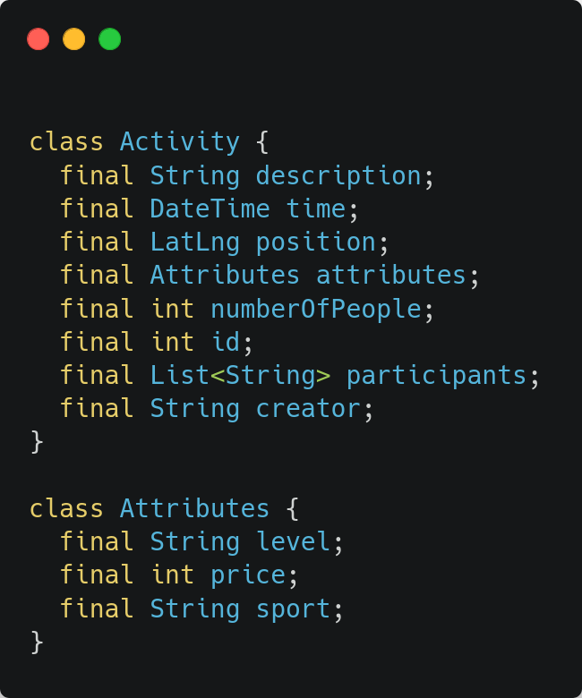 

---

<!-- _class: lead--->

## FeedbackData

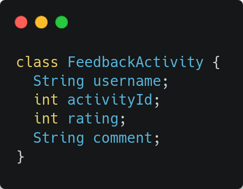
 **Feedback**: Contiene dati relativi ai feedback (punteggio, messaggio, attività associata)

---

### Provider

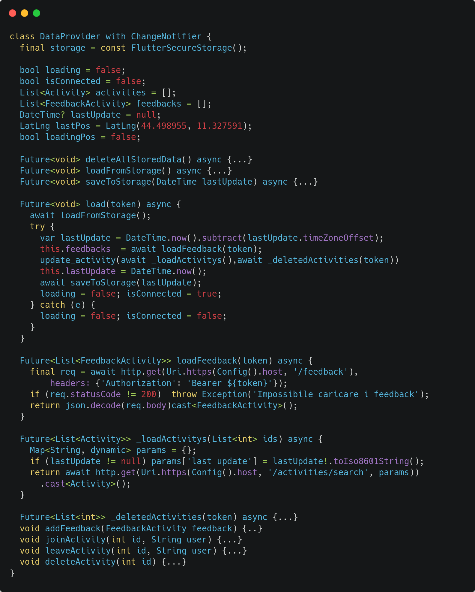

<!-- _class: lead -->

Un provider gestisce e fornisce dati e stato all'applicazione, migliorando la separazione tra logica di business e interfaccia utente.

- **Activity Data**: Metodi e dati per caricare, modificare ed eliminare attività
- **Auth**: Metodi e dati per gestire autenticazione e accesso utente

---
<!-- _class: lead--->

# Pagine

Andiamo a definire le pagine che compongono l'applicazione

---

### Home

Carica il file home, che controlla se è stato salvato un authetication token valido.

- Carica la pagina **Search** se il token è valido
- Carica la pagina di **Registrazione e Login** se il token non è valido

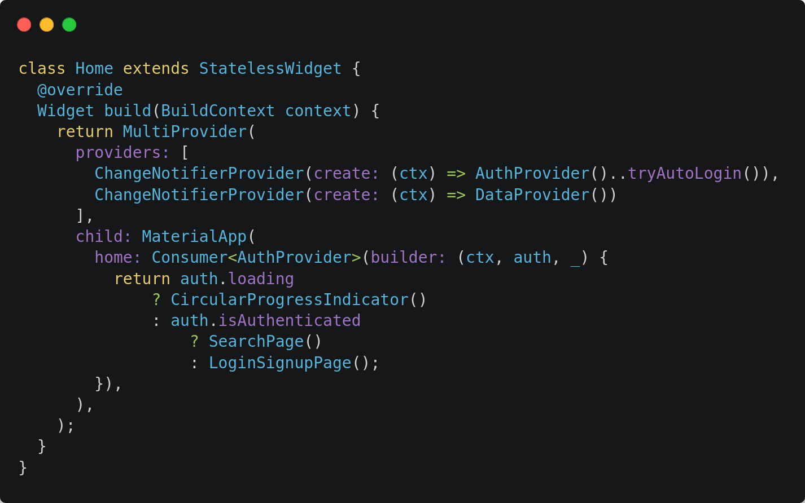

---

### Registrazione e Accesso

Prima pagina visualizzata per accesso e registrazione.
Questa utilizza il provider Auth per registrare il token.

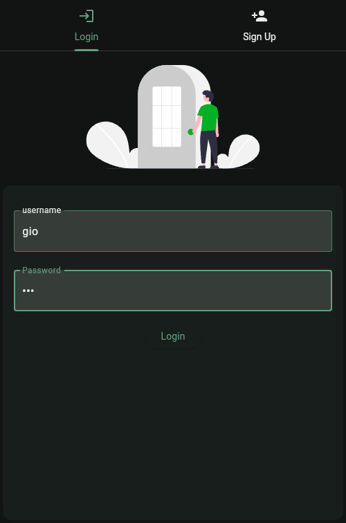 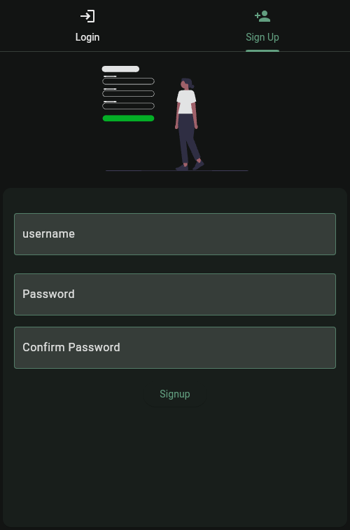

---

### Search

Pagina complessa che permette di cercare eventi sportivi con filtri e due modalità di visualizzazione (mappa e lista).

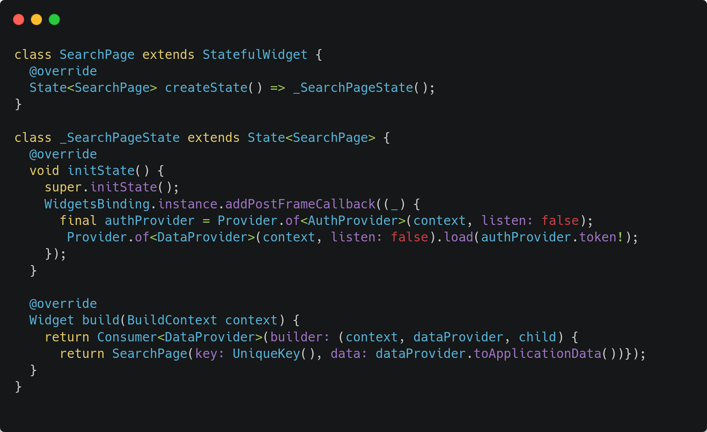 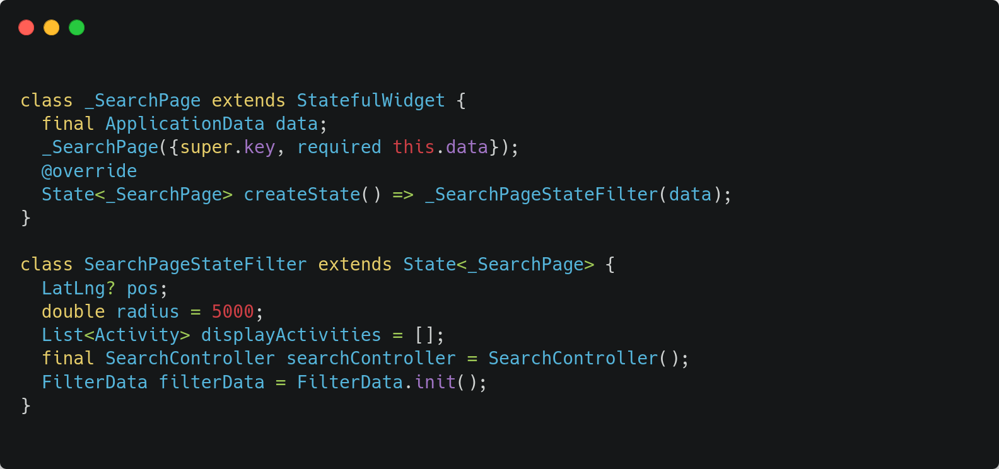

---

### Modalità di Visualizzazione

- **Mappa**: Visualizzazione eventi tramite marker
- **Lista**: Visualizzazione dettagliata degli eventi

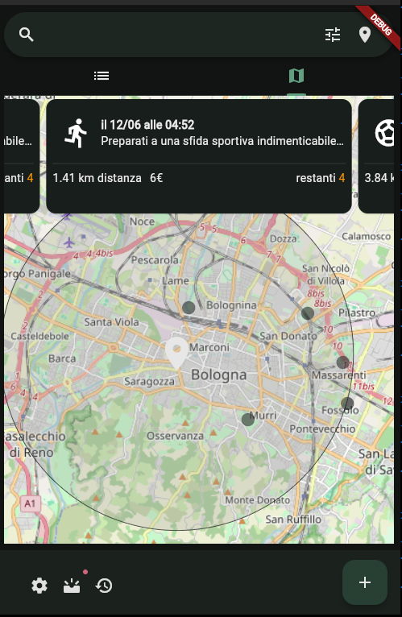
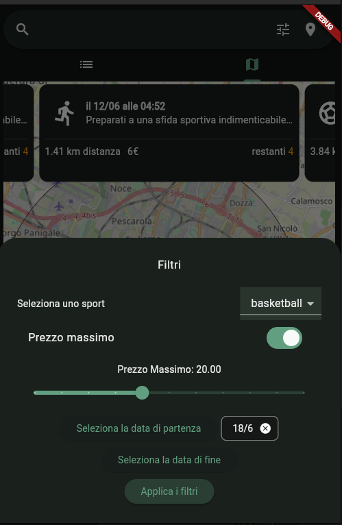
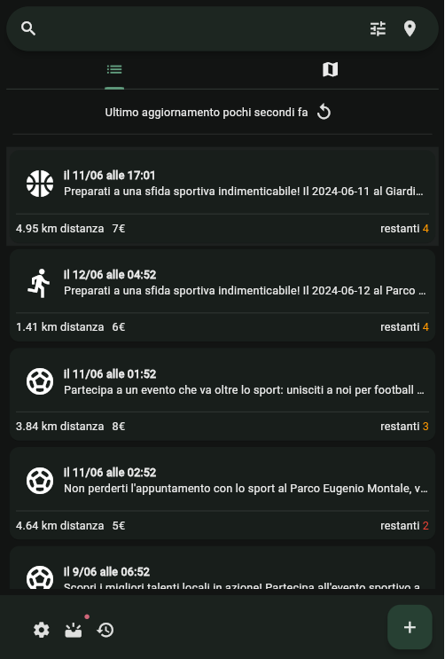

---

### Cambia raggio 

Questa activity serve per cambiare il raggio di ricerca della search.

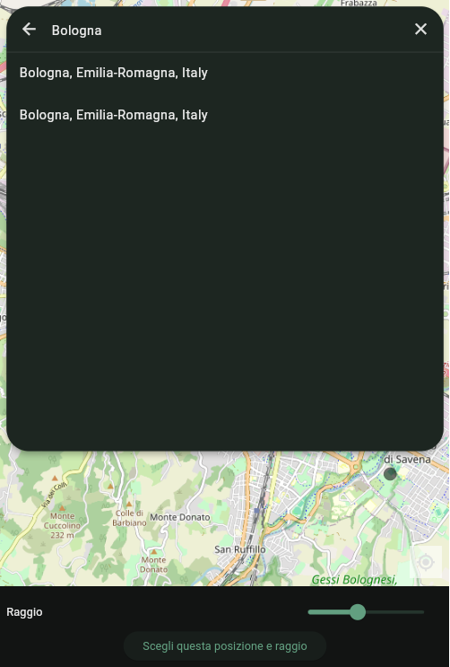
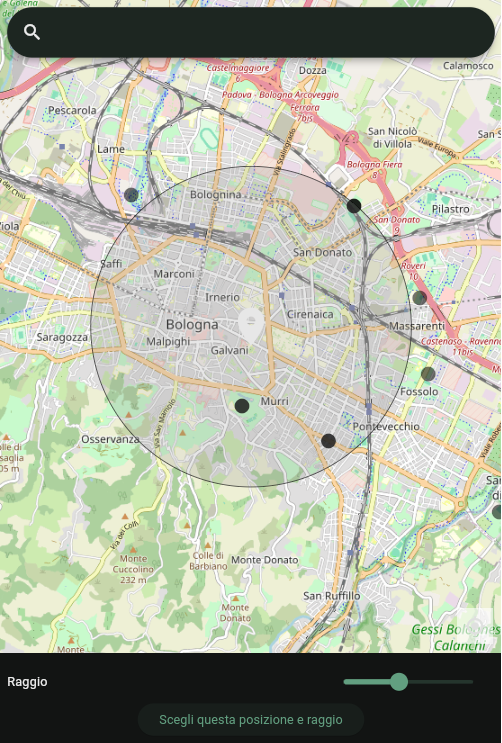

---

### Aggiungi attività

Compilazione di diverse pagine per creare un'attività sportiva:

- **Posizione**: Selezione posizione evento
- **Data**: Selezione data e ora evento
- **Dettagli**: Descrizione evento, disciplina sportiva, partecipanti, prezzo

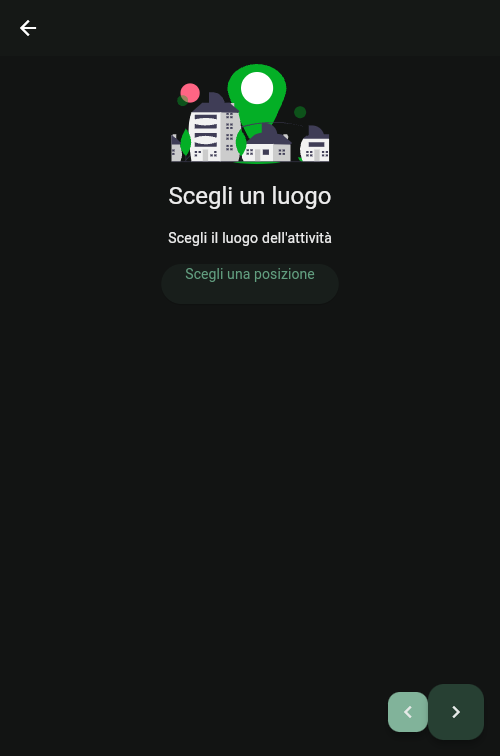
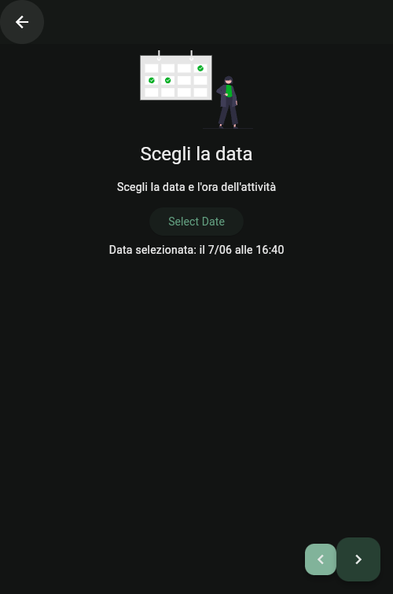
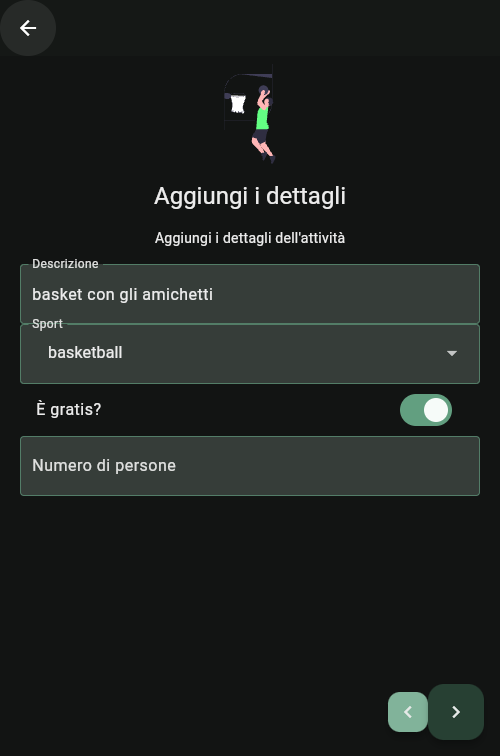

---

### Partecipa ad un'attività

Cliccare sul bottone "partecipa" per aggiungersi alla lista dei partecipanti e impostare un promemoria per l'evento, tramite il bottone di notifica.

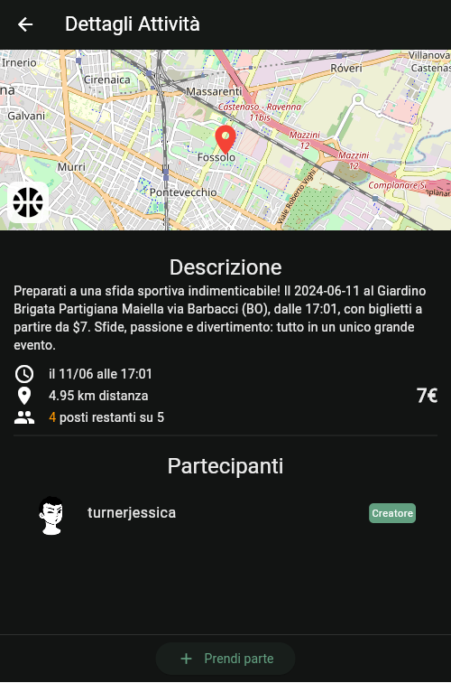 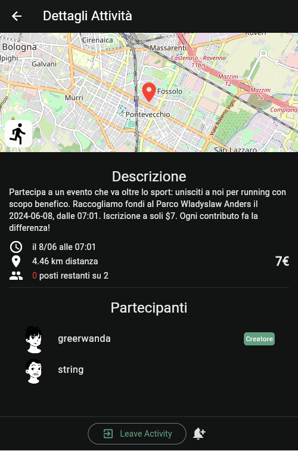

---

### Storia

Visualizzare eventi passati e aggiungere feedback.

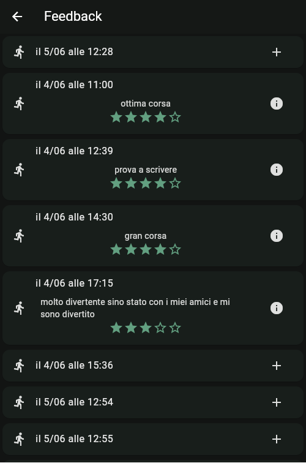 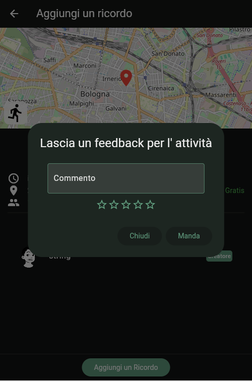

---

### Impostazioni

Modifica delle informazioni utente e delle notifiche evento. Disconnessione dall'account e eliminazione dati locali.

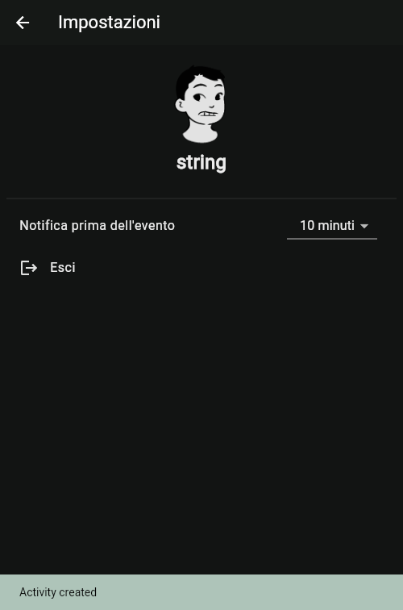
